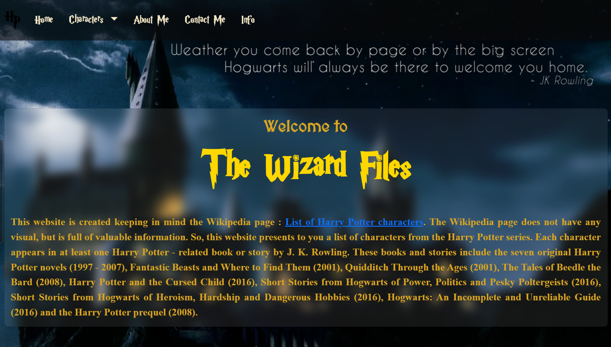
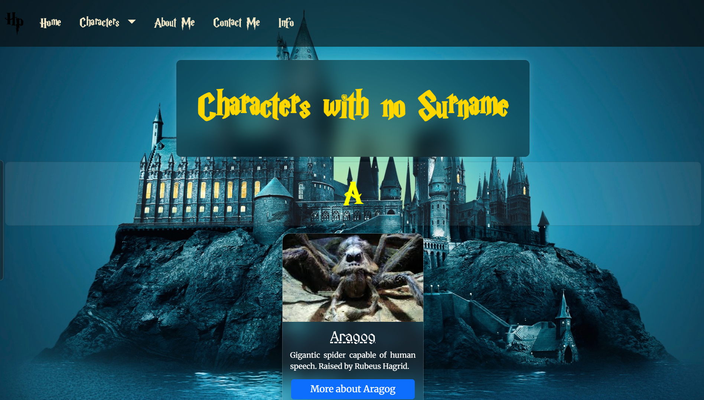
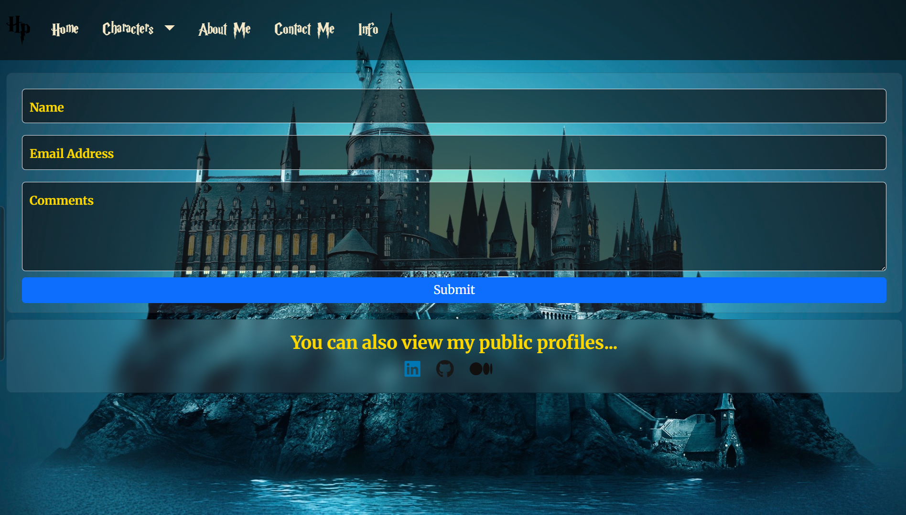

# 🧙‍♂️ The Wizard Files

**The Wizard Files** is a beautifully themed fan-made website dedicated to listing characters from the Harry Potter universe. Built with HTML, CSS, and Bootstrap, it organizes characters by surname and provides additional info pages, all wrapped in a magical visual style.

---

## 🌐 Live Website

👉 **Visit Here:**  [The Wizard Files](https://4m4nd3y.github.io/the-wizard-files/)

---

## 📌 Features

-   🪄 Magical design inspired by Harry Potter
-   🧑‍🤝‍🧑 Characters listed alphabetically by surname and without surname
-   📖 Detailed character pages with images and descriptions
-   💌 `Contact Me` page powered by **[Web3Forms](https://web3forms.com/)**.
-   🎨 Magical Harry Potter theme with custom fonts and transitions.
-   🔗 Social links to LinkedIn, GitHub, and Medium.
-   📱 Fully responsive design using Bootstrap.

---

## 🛠 Tech Stack

-   **HTML5**
-   **CSS3**
-   **Bootstrap 5**
-   **Google Fonts** (including custom Harry Potter font)
-   **Font Awesome**
-   **Web3Forms** (for contact form submission)

---

## 📸 Screenshots

### 🔹 Homepage

### 🔹 Characters by Surname Page

### 🔹 Characters with no Surname Page

### 🔹 Contact Me Page

---

## ⚠️ Disclaimer

This project is an unofficial, fan-made website based on the **Harry Potter universe**.

-   All content such as names, characters, and images belongs to **J.K. Rowling**, **Warner Bros.**, and other rightful owners.
-   No copyright infringement intended.
-   This project is made purely for educational and non-commercial purposes.
-   If you are the owner of any content and would like it removed, please contact me via the [Contact Me](https://4m4nd3y.github.io/the-wizard-files/contact-me.html) page or you can directly mail me at [amandey.contact@gmail.com](mailto:amandey.contact@gmail.com).

---

## 📬 Contact

You can reach me out via the [Contact Me](https://4m4nd3y.github.io/the-wizard-files/contact-me.html) page on the website or through the following platforms:

-   [LinkedIn](https://www.linkedin.com/in/amandey)
-   [GitHub](https://github.com/4M4ND3Y)
-   [Medium](https://amandey.medium.com)

---

## ✅ Deployment

The website is hosted via **GitHub Pages**.

To view it live:  
➡️ [The Wizard Files](https://4m4nd3y.github.io/the-wizard-files/)

---

✨ Designed and developed with magic by **Aman Dey**
